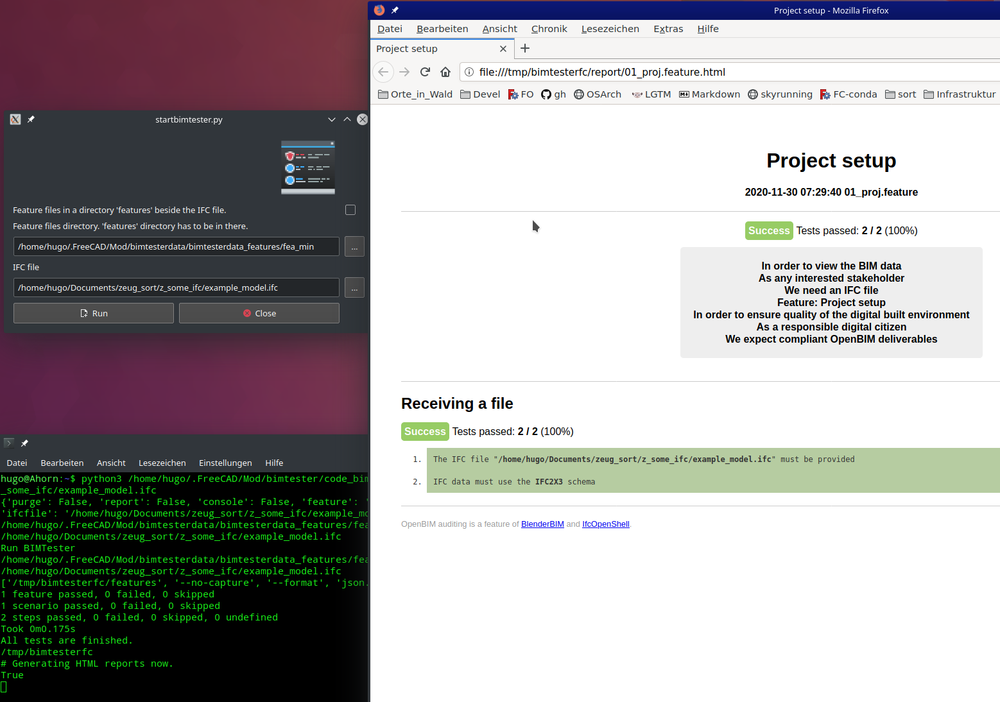

# BIMTester
### Screen shot

### Installation and run
+ Install via AddOn manager
+ Install missing dependencies
    + behave (at least 1.2.6)
    + pystache
    + ifcopenshell (on Windows FreeCAD this may included already)
+ start FreeCAD, switch to BIMTester, the Gui will start
+ choose ifc file
+ the feature file directory is set to a very simple included example feature file
+ click on run
+ :-)
